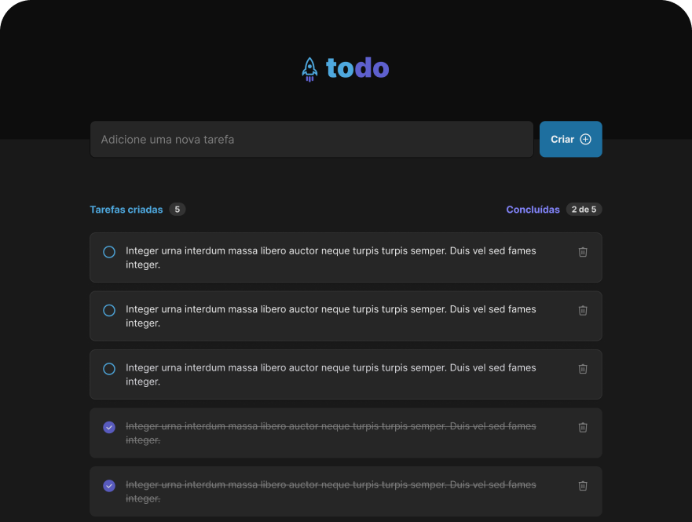

  

 

 Um projeto simples que permite a criação de tarefas. Podemos criar, alterar e deletar. Em toda interação seremos notificados com um toast no topo da tela.

 

  

 

## ⚡ Stack utilizada

- [ReactJS](https://pt-br.reactjs.org/)
- [Vite](https://vitejs.dev/)
- [Typescript](https://www.typescriptlang.org)
- [CSS-Modules](https://github.com/css-modules/css-modules)
- [React-hot-toast](https://react-hot-toast.com/)
- [Phosphor-icons](https://phosphoricons.com/)